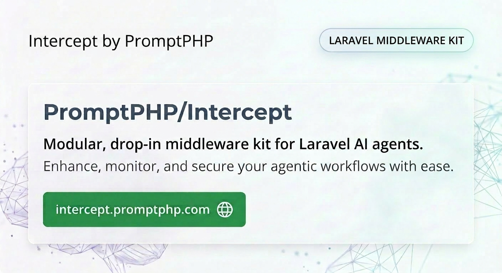

    

    

## Introduction

Intercept is a modular, drop-in collection of reusable AI agent middlewares for the [Laravel AI SDK](https://github.com/laravel/ai).

## Requirements

> Requires PHP 8.3+ and `laravel/ai`.

## Available Middlewares

Browse the full, always-up-to-date catalog of middlewares on the [documentation site](https://intercept.promptphp.com).

## Official Documentation

Documentation for Intercept can be found on the [documentation site](https://intercept.promptphp.com).

## Contributing

Thank you for considering contributing to Intercept! The contribution guide can be found in
[CONTRIBUTING.md](CONTRIBUTING.md).

## Code of Conduct

In order to ensure that the community is welcoming to all, please review and abide by the
[Code of Conduct](CODE_OF_CONDUCT.md).

## Security Vulnerabilities

Please review [our security policy](SECURITY.md) on how to report security vulnerabilities.

## License

Intercept is open-sourced software licensed under the [MIT license](LICENSE.md).