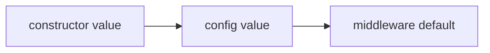

Every middleware package includes internal defaults that can be overridden via the constructor, so you can install the package and use the middleware immediately.

<Tip>
    Publishing the config is useful when you want global defaults across your application.
</Tip>

## Publish the config

```bash
php artisan vendor:publish --tag=intercept-config
```

This creates:

```text
config/intercept.php
```

## Configuration priority

Configuration is resolved in this order:



That means constructor values always win.

This gives you two levels of control:

1. global application defaults in `config/intercept.php`
2. per-agent overrides in middleware constructors

## Configuration examples

### Global config example

```php
'injection_guard' => [
    'action' => 'block',
],

'pii_redactor' => [
    'action' => 'redact',
],
```

This sets defaults for every agent that uses these middleware classes.

### Per-agent override example

You can override global config for a specific agent:

```php
use PromptPHP\Intercept\InjectionGuard\PromptInjectionGuard;
use PromptPHP\Intercept\PIIRedactor\PIIRedactor;

public function middleware(): array
{
    return [
        new PromptInjectionGuard(
            action: 'log',
        ),

        new PIIRedactor(
            action: 'log',
            blockEntities: [],
        ),
    ];
}
```

Even if your config says `block` or `redact`, these constructor values take priority for this agent.

## Middleware configuration options

### Injection Guard options

| Option               | Type     | Default | Description                                                |
| -------------------- | -------- | ------- | ---------------------------------------------------------- |
| `action`             | `string` | `block` | How to handle detected prompt injection attempts.          |
| `patterns`           | `array`  | `[]`    | Custom regex patterns.                                     |
| `merge_patterns`     | `bool`   | `true`  | Whether custom patterns are merged with built-in patterns. |
| `normalise_prompt`   | `bool`   | `true`  | Whether to normalise prompts before scanning.              |
| `log_prompt_preview` | `bool`   | `false` | Whether logs may include a short prompt preview.           |

Supported actions:

1. block
2. log
3. warn
4. sanitize


### PII Redactor options

| Option               | Type     | Default                | Description                                      |
| -------------------- | -------- | ---------------------- | ------------------------------------------------ |
| `action`             | `string` | `redact`               | How to handle detected PII.                      |
| `entities`           | `array`  | supported entities     | Which entity types to detect.                    |
| `block_entities`     | `array`  | high-risk entities     | Which entities should always block.              |
| `allowed_emails`     | `array`  | `[]`                   | Email addresses that should not be redacted.     |
| `allowed_domains`    | `array`  | `[]`                   | Email domains that should not be redacted.       |
| `replacement_format` | `string` | `[{{TYPE}}_{{INDEX}}]` | Placeholder format for redaction.                |
| `mask_character`     | `string` | `*`                    | Character used when masking values.              |
| `log_detections`     | `bool`   | `true`                 | Whether detections should be logged.             |
| `log_preview`        | `bool`   | `false`                | Whether logs may include a short prompt preview. |

Supported actions:

1. redact
2. mask
3. log
4. block

Supported entities:

1. email
2. phone
3. credit_card
4. ip_address
5. api_key
6. bearer_token

## Recommended config

In my opinion, a good production default would be:

```php
return [
    'middleware' => [
        'injection_guard' => [
            'action' => 'block',
            'log_prompt_preview' => false,
        ],

        'pii_redactor' => [
            'action' => 'redact',
            'block_entities' => [
                'credit_card',
                'api_key',
                'bearer_token',
            ],
            'log_detections' => true,
            'log_preview' => false,
        ],
    ],
];
```

This blocks prompt injection attempts, redacts common structured PII, blocks high-risk secrets, and avoids logging prompt previews.

## Config caching

After changing config in production, clear and rebuild your application cache as needed.

```bash
php artisan optimize:clear
```

If your deployment process caches config, run:

```bash
php artisan config:cache
```

## Next step

Explore the available [middleware collection](/middleware) to see which ones you need.

<Card title="Middleware collection" icon="shield" href="/middleware">
    Learn about the different middleware options available in Intercept.
</Card>
