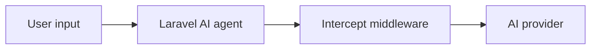

AI agents can read context, understand intent, call tools, and take action.

That makes them powerful, but also risky.

The [Laravel AI SDK's](https://laravel.com/docs/13.x/ai) agent class supports middleware, which allows developers to intercept and modify prompts before they are sent to the AI provider.

Intercept is simply a collection of middleware for your Laravel AI agents.

<Tip>
    Each Intercept middleware can be installed independently. You may choose to
    install only the middleware you need, or you can install the full collection.
</Tip>

## How it works

Intercept middleware sits between your Laravel AI agent and your AI provider.



Each middleware is fully customisable and can inspect the prompt and decide what should happen next.

For example, Injection Guard can block prompt injection attempts before the prompt reaches the provider.

PII Redactor can redact emails, phone numbers, IP addresses, and other structured sensitive data before the prompt is sent.

## Current middleware collection

### Injection Guard

Injection Guard detects common prompt injection attempts such as “ignore previous instructions” and can take action before the prompt reaches the provider.

### PII Redactor

PII Redactor detects structured sensitive values such as IP addresses and can take action before the prompt reaches the provider.

## Configuration style

Intercept uses one shared config file `config/intercept.php` publishable with:

```bash
php artisan vendor:publish --tag=intercept-config
```

Every middleware works without publishing config. Published config is only needed when you want global defaults.

Configuration is resolved in this order:

```text
constructor value > config value > internal middleware default
```

That means you can define global defaults in config while still overriding behaviour per agent.

## Intercept use cases

Use Intercept when your Laravel app accepts user input and sends it to AI agents or providers.

It is especially useful for:

- public AI chat interfaces
- support agents
- internal assistants
- admin copilots
- tool-calling agents
- workflows that handle sensitive user content

## What Intercept is not

Intercept is not a complete AI security platform.

It is a practical middleware layer that helps you add a final line of defense before prompts reach an AI provider.

It should be used alongside other controls, including:

- tool permission checks
- client-side and server-side validation
- least-privilege access
- audit logging
- provider safety controls
- human approval for high-risk actions

## Next step

Check out the [quickstart guide](/quickstart) to get started.

<Card title="Quickstart" icon="rocket" href="/quickstart">
    Get started with Intercept.
</Card>
<Card title="Configuration" icon="cog" href="/configuration">
    Intercept uses one shared config file `config/intercept.php` for all middleware.
</Card>
<Card title="Middleware collection" icon="shield" href="/middleware">
    Learn about the different middleware options available in Intercept.
</Card>
