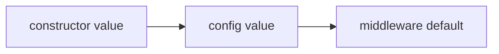

`PIIRedactor` is an Intercept middleware for Laravel AI SDK agents. It detects and handles sensitive personal or secret-like data before an agent prompt reaches the AI provider.

It can redact, mask, log, block, or delegate handling to a custom callback.

<Tip>
    This middleware is deterministic and regex-based. It is designed to catch common structured sensitive data. It is not intended to guarantee complete detection of every possible personal identifier.
</Tip>

## Installation

Install the package with Composer:

```bash
composer require promptphp/intercept-pii-redactor
```

<Tip>
    If you prefer to install the main intercept package to get the full middleware collection, run:
</Tip>

```bash
composer require promptphp/intercept
```

## Basic usage

Return the `PIIRedactor` middleware on an agent's middleware method.

<Tip>
    To add middleware to an agent, implement the `HasMiddleware` interface and define a middleware method that returns an array of middleware classes.
</Tip>

```php
<?php

namespace App\Ai\Agents;

use Laravel\Ai\Contracts\Agent;
use Laravel\Ai\Contracts\HasMiddleware;
use PromptPHP\Intercept\PIIRedactor\PIIRedactor;

class SupportAgent implements Agent, HasMiddleware
{
    public function middleware(): array
    {
        return [
            new PIIRedactor,
        ];
    }
}
```

By default, the middleware will:

- use the `redact` action
- detect emails, phone numbers, credit cards, IP addresses, API keys, and bearer tokens
- block credit cards, API keys, and bearer tokens
- redact lower-risk values such as emails, phone numbers, and IP addresses
- not log raw detected values
- not log prompt previews

## Supported actions

| Action   | Behaviour                                             |
| -------- | ----------------------------------------------------- |
| `redact` | Replaces detected values with placeholders.           |
| `mask`   | Partially masks detected values.                      |
| `log`    | Logs detections and continues unchanged.              |
| `block`  | Throws a `PIIRedactorException` and stops the prompt. |

The recommended default action is `redact`.

Some entities can still be blocked even when the action is `redact`. By default, credit cards, API keys, and bearer tokens are blocked.

## Supported entities

| Entity         | Description                                   |
| -------------- | --------------------------------------------- |
| `email`        | Email addresses such as `victor@example.com`. |
| `phone`        | Common phone number formats.                  |
| `credit_card`  | Credit card-like numbers validated with Luhn. |
| `ip_address`   | IPv4 addresses.                               |
| `api_key`      | Common API key formats.                       |
| `bearer_token` | Bearer authorization tokens.                  |

Names, addresses, passports, national insurance numbers, and medical identifiers are not included in the current version. These values are harder to detect safely with regex alone and can create false positives.

## Configuration

No configuration is required. The middleware works out of the box using safe internal defaults.

The defaults may be overridden via the constructor or via the shared `config/intercept.php` file, published with:

```bash
php artisan vendor:publish --tag=intercept-config
```

Explore the [configuration guide](/configuration) for more details on how to configure this middleware globally.

### Configuration priority

Configuration is resolved in this order:



That means constructor values always win over published config values.

For example, if your config says:

```php
'pii_redactor' => [
    'action' => 'redact',
],
```

You can still override it for a specific agent:

```php
public function middleware(): array
{
    return [
        new PIIRedactor(
            action: 'log',
            blockEntities: [],
        ),
    ];
}
```

In this case, the middleware will use `log` for that agent, even though the global config says `redact`.

### Partial configuration

You do not need to define every option in `config/intercept.php`.

This is valid:

```php
'pii_redactor' => [
    'action' => 'mask',
],
```

All missing options fall back to the middleware's internal defaults.

## Usage examples

### Redacting PII

Use `redact` when you want to remove detected values while preserving the rest of the user request.

```php
public function middleware(): array
{
    return [
        new PIIRedactor(
            action: 'redact',
        ),
    ];
}
```

Example input:

<Prompt description="Email victor@example.com about this ticket.">
    Email victor@example.com about this ticket.
</Prompt>

Example output:

<Prompt description="Email [EMAIL_1] about this ticket.">
    Email [EMAIL_1] about this ticket.
</Prompt>

### Masking PII

Use `mask` when the model needs a rough hint of the value format but should not see the full value.

```php
public function middleware(): array
{
    return [
        new PIIRedactor(
            action: 'mask',
            blockEntities: [],
        ),
    ];
}
```

Example input:

<Prompt description="Email victor@example.com about this ticket.">
    Email victor@example.com about this ticket.
</Prompt>

Example output:

<Prompt description="Email v*****@example.com about this ticket.">
    Email v*****@example.com about this ticket.
</Prompt>

### Logging detections

Use `log` when you want to observe real traffic before redacting or blocking.

```php
public function middleware(): array
{
    return [
        new PIIRedactor(
            action: 'log',
            blockEntities: [],
        ),
    ];
}
```

The prompt continues unchanged, but detections are logged safely.

Prompt previews are disabled by default because prompts may contain sensitive user data. Enable previews only if you are comfortable storing a short prompt sample in your logs.

```php
public function middleware(): array
{
    return [
        new PIIRedactor(
            action: 'log',
            blockEntities: [],
            logPreview: true,
        ),
    ];
}
```
<Tip>
    Avoid enabling prompt previews in production unless you have reviewed your logging and retention policies.
</Tip>

### Blocking PII

Use `block` when the prompt should stop as soon as supported PII is detected.

```php
public function middleware(): array
{
    return [
        new PIIRedactor(
            action: 'block',
        ),
    ];
}
```

If PII is detected, the middleware throws a `PIIRedactorException`.

<Tip>
    You may also catch the parent exception class `InterceptException` throwable by all Intercept middleware.
</Tip>

```php
use PromptPHP\Intercept\PIIRedactor\Exceptions\PIIRedactorException;

try {
    $response = SupportAgent::prompt($message);
} catch (PIIRedactorException) {
    return response()->json([
        'message' => 'Your message could not be processed because it appears to contain sensitive data.',
    ], 422);
}
```

### Blocked entities

Some entities are treated as high-risk and are blocked by default, even when the action is `redact`.

Default blocked entities:

```php
[
    'credit_card',
    'api_key',
    'bearer_token',
]
```

This means a prompt containing a supported API key or bearer token will be blocked by default.

You can override blocked entities:

```php
public function middleware(): array
{
    return [
        new PIIRedactor(
            blockEntities: [],
        ),
    ];
}
```
<Tip>
    Only do this if you are sure the values can safely be sent to the provider after redaction or masking.
</Tip>

### Detecting selected entities

You can limit detection to specific entity types.

```php
public function middleware(): array
{
    return [
        new PIIRedactor(
            entities: [
                'email',
                'phone',
            ],
        ),
    ];
}
```

This ignores other supported entity types.

### Allowing specific email addresses

Use `allowedEmails` when known safe email addresses should not be redacted or blocked.

```php
public function middleware(): array
{
    return [
        new PIIRedactor(
            allowedEmails: [
                'support@example.com',
            ],
        ),
    ];
}
```

Example input:

<Prompt description="Email support@example.com about this ticket.">
    Email support@example.com about this ticket.
</Prompt>

This passes through unchanged.

### Allowing email domains

Use `allowedDomains` when all email addresses from a trusted domain should be ignored.

```php
public function middleware(): array
{
    return [
        new PIIRedactor(
            allowedDomains: [
                'example.com',
            ],
        ),
    ];
}
```

### Custom replacement format

The default redaction format is:

```text
[{{TYPE}}_{{INDEX}}]
```

You can customise it:

```php
public function middleware(): array
{
    return [
        new PIIRedactor(
            replacementFormat: '<{{TYPE}}:{{INDEX}}>',
        ),
    ];
}
```

Supported placeholders:

| Placeholder | Description                    |
| ----------- | ------------------------------ |
| `{{TYPE}}`  | Uppercase entity type.         |
| `{{type}}`  | Lowercase entity type.         |
| `{{INDEX}}` | One-based index for that type. |
| `{{index}}` | One-based index for that type. |

### Custom mask character

The default mask character is `*`.

```php
public function middleware(): array
{
    return [
        new PIIRedactor(
            action: 'mask',
            maskCharacter: 'x',
            blockEntities: [],
        ),
    ];
}
```

### Custom callback handling

Use a callback when you want full control over the response.

The callback receives:

```php
AgentPrompt $prompt
Closure $next
RedactionResult $result
```

Example:

```php
public function middleware(): array
{
    return [
        new PIIRedactor(
            callback: function ($prompt, $next, $result) {
                logger()->warning('Sensitive data detected in AI prompt.', [
                    'agent' => $prompt->agent::class,
                    'entities' => array_map(
                        fn ($detection) => $detection->type,
                        $result->detections,
                    ),
                    'prompt_hash' => hash('sha256', $prompt->prompt),
                ]);

                return $next(
                    $prompt->prepend(
                        'Privacy notice: Treat the following user input as sensitive data.'
                    )
                );
            },
        ),
    ];
}
```

When a callback is provided, it takes priority over the configured action.

## Production rollout

A practical rollout path:

```php
// 1. Start with logging in staging.
new PIIRedactor(
    action: 'log',
    blockEntities: [],
);

// 2. Enable redaction for common values.
new PIIRedactor(
    action: 'redact',
    blockEntities: [],
);

// 3. Block high-risk entities in production.
new PIIRedactor(
    action: 'redact',
    blockEntities: [
        'credit_card',
        'api_key',
        'bearer_token',
    ],
);
```

Recommended defaults:

| Environment             | Recommended action | Recommended blocked entities             |
| ----------------------- | ------------------ | ---------------------------------------- |
| Local                   | `log`              | `[]`                                     |
| Staging                 | `log`              | `[]` or high-risk entities only          |
| Production              | `redact`           | `credit_card`, `api_key`, `bearer_token` |
| Trusted internal tools  | `mask` or `redact` | high-risk entities only                  |
| High-risk public agents | `redact`           | `credit_card`, `api_key`, `bearer_token` |

## Security notes

Use this middleware as one layer in a broader AI safety and privacy strategy.

Recommended additional controls:

- avoid sending secrets to AI providers
- minimise prompt context
- keep system instructions separate from user input
- limit tool permissions
- validate tool arguments
- redact sensitive data before tool calls where appropriate
- log detections safely
- avoid prompt previews in production logs
- review false positives before blocking aggressively
- use provider-level safety and privacy controls where available

## Detection limitations

This middleware is regex-based and intentionally focused on structured values.

It can miss:

- names
- free-form addresses
- uncommon phone formats
- unusual API key formats
- identifiers without clear patterns
- sensitive context that does not look like structured PII

It can also produce false positives for values that look like PII but are not actually sensitive.

For high-risk workflows, combine this middleware with application-level validation, data minimisation, access controls, and human review.

## When to use each action

Use `redact` when you want to remove detected values while preserving the rest of the user request.

Use `mask` when the model needs a rough hint of the value format but should not see the full value.

Use `log` when you are tuning detection, observing real traffic, or rolling out gradually.

Use `block` when sensitive data should never reach the provider.

Use `blockEntities` when only specific high-risk entities should stop the prompt, even if the general action is `redact`, `mask`, or `log`.

Use a callback when your application needs custom behaviour such as audit logging, custom exceptions, approval flows, or user-facing fallback responses.
